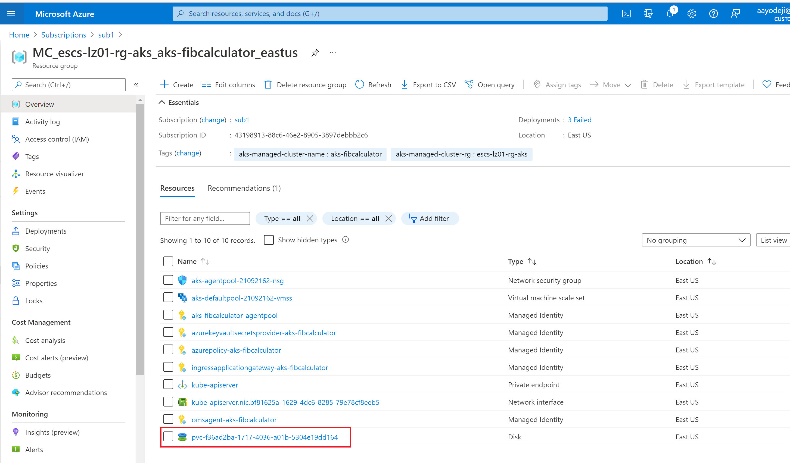

## Deploy the workload

Now that our environment is all setup, we will begin the steps required to deploy our fib calculator

### Deploy worker, client and Redis

1. If you havent yet, ensure your VM has all the environment variables your had in your local computer terminal. Log into your newly created AKS cluster. Make sure you set the environment variables in the command below before you run them if you haven't already. The cluster name can be found in the spoke resource group.

   ```bash
   az aks get-credentials -n $AKSCLUSTERNAME -g $AKSRESOURCEGROUP
   ```

2. Complete the sign in process and check the nodes

   ```bash
   kubectl get nodes
   ```

3. Switch to the folder that has the kubernetes manifest files

   ```bash
   cd ../k8s
   ```

4. Expand the k8s folder within the deployment folder. There you will find the files the developer used to create the initial deployments.

5. Open the client deployment file and replace the `mosabami` (developer's Docker hub username) with the name of your ACR for the image parameter. Your result should look similar to this: `eslzacr7z6cmpr2wmwso.azurecr.io/smartbrainworker:v2`. Your ACR needs to be used because your policy wont allow images be pulled from container registries outside ACR.

   ```bash
   code client-deployment.yaml
   ```

6. Change the client deployment code so that it points to your ACR

   ```yaml
   apiVersion: apps/v1
   kind: Deployment
   metadata:
     name: client-deployment
   spec:
     replicas: 2
     selector:
       matchLabels:
         component: web
     template:
       metadata:
         labels:
           component: web
       spec:
         containers:
           - name: client
             image: <acr name>.azurecr.io/smartbrainclient
             imagePullPolicy: Always
             ports:
               - containerPort: 3000
             readinessProbe: # is the container ready to receive traffic?
               initialDelaySeconds: 10
               httpGet:
                 port: 3000
                 path: /healthz
             livenessProbe: # is the container healthy?
               initialDelaySeconds: 2
               periodSeconds: 5
               httpGet:
                 port: 3000
                 path: /healthz
             env:
               - name: SERVER_URL
                 value: server-service
               - name: WORKER_URL
                 value: worker-service
   ```

7. Deploy the client pod and the client service

   ```bash
   kubectl apply -f client-deployment.yaml
   kubectl apply -f client-service.yaml
   ```

8. Create a new file for the redis deployment persistent volume claim. This will allow the data stored in redis cache to persist even after the pod has been deleted or restarted.

   ```bash
   code redis-persistent-volume-claim.yaml
   ```

9. Copy the code below into that file and save it

   ```yaml
   apiVersion: v1
   kind: PersistentVolumeClaim
   metadata:
     name: redis-persistent-volume-claim
   spec:
     accessModes:
       - ReadWriteOnce
     storageClassName: managed-premium
     resources:
       requests:
         storage: 1Gi
   ```

10. Deploy the persistent volume claim

    ```bash
    kubectl apply -f redis-persistent-volume-claim.yaml
    ```

11. Open the redis deployment file

    ```
    code redis-deployment.yaml
    ```

12. update it so that it now uses your image and the persistent volume claim you just created. The result should look like the code below. Save it.

    ```yaml
    apiVersion: apps/v1
    kind: Deployment
    metadata:
      name: redis-deployment
    spec:
      replicas: 1
      selector:
        matchLabels:
          component: redis
      template:
        metadata:
          labels:
            component: redis
        spec:
          volumes:
            - name: redis-storage
              persistentVolumeClaim:
                claimName: redis-persistent-volume-claim
          containers:
            - name: redis
              image: <acr name>.azurecr.io/redis
              imagePullPolicy: Always
              resources:
                limits:
                  memory: '128Mi'
                  cpu: '500m'
              ports:
                - containerPort: 6379
              volumeMounts:
                - name: redis-storage
                  mountPath: '/data'
    ```

13. Deploy the redis pod

    ```bash
    kubectl apply -f redis-deployment.yaml
    ```

    If you check the AKS infrastructure resource group on Azure you will notice that a managed premium disk has now been dynamically provisioned for you by the persistent volume claim



6. Deploy the redis service

   ```
   kubectl apply -f redis-service.yaml
   ```

7. Open the worker-deployment.yaml file and replace the `mosabami` in the image parameter like you did in the previous step.

```bash
code  worker-deployment.yaml
```

5. Apply the worker deployment

   ```bash
   kubectl apply -f worker-deployment.yaml
   kubectl apply -f worker-service.yaml
   ```

### Deploy http Ingress and Backend Server

We will begin by deploying the ingress without TLS. To do this we need to temporarily allow access to application gateway via port 80. This option is disabled during our infrastructure deployment because doing so is more secure. For now, we want to test the application without having to deploy TLS so we will open it up at the NSG. You can find instructions on how to do that [here](https://github.com/Azure/Enterprise-Scale-for-AKS/blob/main/Scenarios/AKS-Secure-Baseline-PrivateCluster/Terraform/08-workload.md#allow-access-to-the-application-gateway-via-port-80-will-be-updated-to-https-soon)

Now that the NSG has been opened up, we begin by deploying the ingress. We are using AGIC. The developer used nginx. We need to update the ingress service to use AGIC. AGIC does not allow the use or regex and does not allow us to rewrite target. The original server deployment used NGINX which has these features. So when it receives requests with "/api" in the url, it removes the "/api" (rewrite target) form the url and sends the request to the server. Since AGIC doesnt have that feature, we had to change the server code to now expect "/api" in the url to make up for the limitations of AGIC. We decided to use AGIC in this deployment because it has lots of useful features for AKS deployments like the fact that we don't need an additional loadbalancer in front of the ingress controller. NGINX would have deployed one.

1. Create a new http ingress file

   ```bash
   code http-ingress.yaml
   ```

2. Copy the code below into the new file and save it. Take a minute to compare this new file with the previous NGINX ingress file ingress-service.yaml. One of the big differences is that you'll notice that in the NGINX ingress, we didn't have to list out every path. We used regex to take care of that as well as rewrite target to remove the /api so that this ingress can work with the original server deployment. Since AGIC doesn't have the regex feature, we have to spell out each individual path.

   ```yaml
   apiVersion: networking.k8s.io/v1
   # UPDATE API
   kind: Ingress
   metadata:
     name: ingress-service
     annotations:
       kubernetes.io/ingress.class: 'azure/application-gateway'
       # appgw.ingress.kubernetes.io/backend-path-prefix: "/"
       # nginx.ingress.kubernetes.io/use-regex: 'true'
       # ADD ANNOTATION
       # nginx.ingress.kubernetes.io/rewrite-target: /$1
       # UPDATE ANNOTATION
   spec:
     rules:
       - http:
           paths:
             - path: /api/*
               # UPDATE PATH
               pathType: Prefix
               # ADD PATHTYPE
               backend:
                 service:
                   # UPDATE SERVICE FIELDS
                   name: server-service
                   port:
                     number: 5000
             - path: /worker/*
               # UPDATE PATH
               pathType: Prefix
               # ADD PATHTYPE
               backend:
                 service:
                   # UPDATE SERVICE FIELDS
                   name: worker-service
                   port:
                     number: 2000
             - path: /*
               # UPDATE PATH
               pathType: Prefix
               # ADD PATHTYPE
               backend:
                 service:
                   # UPDATE SERVICE FIELDS
                   name: client-service
                   port:
                     number: 3000
   ```

3. Deploy the ingress controller

   ```bash
   kubectl apply -f http-ingress.yaml
   ```

   Enter the command below and wait until the IP addresss of the ingress shows then cancel with ctrl+c

   ```bash
   kubectl get ingress -w
   ```

   With the IP address you should now be able to view the web page. Note that the web page wont work properly because the server isnt running yet. We will deploy the server next

4. Create a new file for the secret provider class that will be used to pull the postgres database password from keyvault for the server

   ```bash
   code server-secret-provider-class.yaml
   ```

5. Copy the code below and paste it into the file. Replace the placeholder userAssignedIdentityID your client id. If you dont know your client id, you can find the instructions [here](https://github.com/Azure/Enterprise-Scale-for-AKS/blob/main/Scenarios/AKS-Secure-Baseline-PrivateCluster/Bicep/07-workload.md#deploy-the-workload-into-the-cluster). Also replace the placeholder tenantId and the keyvault name

   ```yaml
   apiVersion: secrets-store.csi.x-k8s.io/v1alpha1
   kind: SecretProviderClass
   metadata:
     name: postgres-secret-csi
   spec:
     provider: azure
     secretObjects:
       - secretName: pgpassword
         type: Opaque
         data:
           - objectName: PGPASSWORD
             key: PGPASSWORD
     parameters:
       keyvaultName: <keyvault name>
       useVMManagedIdentity: 'true'
       userAssignedIdentityID: '<client id>' # the client ID of the MSI
       cloudName: ''
       objects: |
         array:
           - |
             objectName: PGPASSWORD       
             objectType: secret              
             objectVersion: ""
       tenantId: '<tenant id>'
   ```

6. Deploy the server secret provider class

   ```bash
   kubectl apply -f server-secret-provider-class.yaml
   ```

7. We don't need Postgres service or deployment anymore because we will be using the managed Postgres database we already deployed. Open the server deployment file and change the server deployment code so that it points to your ACR. You also need to ensure you are using version v2, your PG host points to the internal IP address of your Postgres database and your PGUSER value is similar to this: `<pg user>@<pg database name>`. You will also need to add the secret store volume mount and point the volume to the secret provider class you just created. Save it afterwards.

   ```bash
   code server-deployment.yaml
   ```

8. Update the server deployment file so that it points to your repository. It should also have a volume mount that connects to the secrets store so that it can get the Postgres database password from Key vault. It should also use the IP address of your Postgres database NIC. Your server deployment file should look similar to this

   ```yaml
   apiVersion: apps/v1
   kind: Deployment
   metadata:
     name: server-deployment
   spec:
     replicas: 1
     selector:
       matchLabels:
         component: server
     template:
       metadata:
         labels:
           component: server
       spec:
         containers:
           - name: server
             image: eslzacr7z6cmpr2wmwso.azurecr.io/smartbrainapi:v6
             imagePullPolicy: Always
             volumeMounts:
               - name: secrets-store-inline
                 mountPath: '/mnt/secrets-store'
                 readOnly: true
             ports:
               - containerPort: 5000
             env:
               - name: REDIS_HOST
                 value: redis-service
               - name: REDIS_PORT
                 value: '6379'
               - name: PGUSER
                 value: <pg username login> eg pguser@pgservername
               - name: PGHOST
                 value: <internal ip of Postgres> eg 10.1.1.98
               - name: PGPORT
                 value: '5432'
               - name: PGDATABASE
                 value: postgres
               - name: PGPASSWORD
                 valueFrom:
                   secretKeyRef:
                     name: pgpassword
                     key: PGPASSWORD
               - name: WORKER_URL
                 value: worker-service
             readinessProbe:
               httpGet:
                 path: /
                 port: 5000
               periodSeconds: 3
               timeoutSeconds: 1
         volumes:
           - name: secrets-store-inline
             csi:
               driver: secrets-store.csi.k8s.io
               readOnly: true
               volumeAttributes:
                 secretProviderClass: 'postgres-secret-csi'
   ```

   Deploy the server pod and service

   ```
   kubectl apply -f server-deployment.yaml
   kubectl apply -f server-service.yaml
   ```

   Now that the server has been deployed you can head back to the website, try registering and then try entering url to an image with a face in the space provided. Congratulations you have the workload working!

### Add TLS

Now that you have the workload working, the last step would be to add TLS to your deployment. We will be using a self-signed certificate in this deployment so we dont have to purchase certificates. Follow the instructions [here](https://github.com/Azure/Enterprise-Scale-for-AKS/blob/main/Scenarios/AKS-Secure-Baseline-PrivateCluster/Bicep/07-workload.md#update-the-ingress-to-support-https-traffic) to create a the url and as well as add the certificate as to Key Vault

1. Now that you have created the secret in Key vault and have a public url for your workload you will create the tls certificate secret provider. We delete the current ingress controller then create a new file called tls-cert-secret-provider-class.yaml

   ```
   kubectl delete -f http-ingress.yaml
   code  tls-cert-secret-provider-class.yaml
   ```

2. Enter the code below into the file and save it after you enter the correct keyvault name, userAssignedIdentityID and tenantId

   ```yaml
   apiVersion: secrets-store.csi.x-k8s.io/v1alpha1
   kind: SecretProviderClass
   metadata:
     name: aks-tls-akv
   spec:
     provider: azure
     parameters:
       keyvaultName: <keyvaylt name>
       useVMManagedIdentity: 'true'
       userAssignedIdentityID: '<client id>' # the client ID of the MSI created by the
       objects: |
         array:
           - |
             objectName: aks-ingress-tls
             objectAlias: aks-ingress-tls
             objectType: secret
       # The objectType above is "secret" even though the aks-ingress-tls Certificate in the keyvault is certificate type.
       # Also, the appropriate identity will need acces to GET "secrets" from the KV, as well as GET for "certificates"
       tenantId: <tenant id>
     secretObjects:
       - secretName: aks-tls-akv # k8s secret manifest will be generated and synced after mounting it from pod/deploy
         type: kubernetes.io/tls
         data:
           - objectName: aks-ingress-tls # must match the name of certificate in kv
             key: tls.crt
           - objectName: aks-ingress-tls # must match the name of certificate in kv
             key: tls.key
   ```

3. Deploy the secret-provider-class
   ```
   kubectl apply -f tls-cert-secret-provider-class.yaml
   ```
4. Now that you have created the secret provider class, redeploy the client but this time, you will include the volume mount for the secret provider class you just created. Your new client file should look similar to the code below.

   ```yaml
   apiVersion: apps/v1
   kind: Deployment
   metadata:
     name: client-deployment
   spec:
     replicas: 2
     selector:
       matchLabels:
         component: web
     template:
       metadata:
         labels:
           component: web
       spec:
         containers:
           - name: client
             image: <acr name>.azurecr.io/multi-client
             imagePullPolicy: Always
             ports:
               - containerPort: 3000
             readinessProbe: # is the container ready to receive traffic?
               initialDelaySeconds: 10
               httpGet:
                 port: 3000
                 path: /healthz
             livenessProbe: # is the container healthy?
               initialDelaySeconds: 2
               periodSeconds: 5
               httpGet:
                 port: 3000
                 path: /healthz
             volumeMounts:
               - name: aks-tls-akv
                 mountPath: /mnt/secrets-store
                 readOnly: true
         volumes:
           - name: aks-tls-akv
             csi:
               driver: secrets-store.csi.k8s.io
               readOnly: true
               volumeAttributes:
                 secretProviderClass: 'aks-tls-akv'
   ```

5. We create a new ingress deployment file

   ```bash
   code https-ingress.yaml
   ```

6. Copy and paste the content of your http-ingress.yaml file into this new file and add the annotation in the code block below

   ```bash
   appgw.ingress.kubernetes.io/ssl-redirect: "true"
   ```

7. Add the host url and secret name. The host URL is the URL you just created and used to create the tls certificate. Your new ingress controller file should look similar to the code below

   ```yaml
   apiVersion: networking.k8s.io/v1
   # UPDATE API
   kind: Ingress
   metadata:
     name: ingress-service
     annotations:
       kubernetes.io/ingress.class: 'azure/application-gateway'
       appgw.ingress.kubernetes.io/ssl-redirect: 'true'
       # appgw.ingress.kubernetes.io/backend-path-prefix: "/"
       # nginx.ingress.kubernetes.io/use-regex: 'true'
       # ADD ANNOTATION
       # nginx.ingress.kubernetes.io/rewrite-target: /$1
       # UPDATE ANNOTATION
   spec:
     tls:
       - hosts:
           - smartbrain.centralus.cloudapp.azure.com
         secretName: aks-tls-akv
     rules:
       - host: smartbrain.centralus.cloudapp.azure.com
         http:
           paths:
             - path: /api/*
               # UPDATE PATH
               pathType: Prefix
               # ADD PATHTYPE
               backend:
                 service:
                   # UPDATE SERVICE FIELDS
                   name: server-service
                   port:
                     number: 5000
             - path: /worker/*
               # UPDATE PATH
               pathType: Prefix
               # ADD PATHTYPE
               backend:
                 service:
                   # UPDATE SERVICE FIELDS
                   name: worker-service
                   port:
                     number: 2000
             - path: /
               # UPDATE PATH
               pathType: Prefix
               # ADD PATHTYPE
               backend:
                 service:
                   # UPDATE SERVICE FIELDS
                   name: client-service
                   port:
                     number: 3000
   ```

8. Apply the new ingress controller

   ```bash
   kubectl apply -f https-ingress.yaml
   ```

### Conclusion and cleanup

This marks the end of the tutorial. Feel free to browse to your new website using your URL by appending https:// to the begining. This will be flagged as unsafe (Your connection isnt private warning) since we used a self signed certificate, but you can click on advanced and proceed so you can view your web page. For completeness you can go ahead and delete the port_80 inbound rule you created earlier for your appgw subnet NSG.

When you are done reviewing the resources you have created, cleanup your resources by following the instructions [here](https://github.com/Azure/Enterprise-Scale-for-AKS/blob/main/Scenarios/AKS-Secure-Baseline-PrivateCluster/Bicep/08-cleanup.md) using your local machine.
